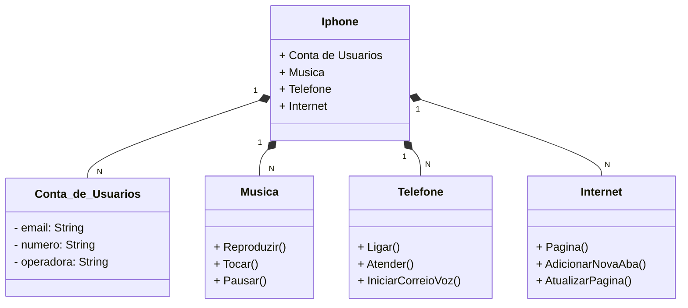

# Desafio DIO - Diagrama de Classes Poo - Uml
desafio de codigo proposto no bootcamp dio innovation

## Diagrama de Classse - Iphone

```mermaid


classDiagram
  class Iphone {
    + Conta de Usuarios
    + Musica
    + Telefone
    + Internet
  }

  class Conta_de_Usuarios {
    - email: String
    - numero: String
    - operadora: String
    
  }

  class Musica {
    + Reproduzir()
    + Tocar()
    + Pausar()
  }

  class Telefone {
    + Ligar()
    + Atender()
    + IniciarCorreioVoz()
  }

  class Internet {
    + Pagina()
    + AdicionarNovaAba()
    + AtualizarPagina()
  }

  Iphone "1" *-- "N" Conta_de_Usuarios
  Iphone "1" *-- "N" Musica
  Iphone "1" *-- "N" Telefone
  Iphone "1" *-- "N" Internet


```
